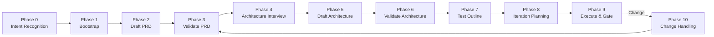

[English](README.md) | [中文](README.zh-CN.md)

# Product Lifecycle

[](LICENSE)
[](https://www.python.org/)
[](https://github.com/wxin9/cc-skill-product-lifecycle/releases)

> AI-collaborative product lifecycle management skill for Claude Code — from PRD to delivery, with script-enforced phase gates and 4-layer artifact validation.

## Why Product Lifecycle?

Managing a product lifecycle manually is error-prone: steps get skipped, document quality varies wildly, and there is no reliable way to enforce that every phase actually completes before the next begins. Claude Code on its own can validate artifacts, but it cannot prevent you from jumping ahead or silently skipping a gate. This skill closes that gap by combining **AI-collaborative drafting** (Claude writes first drafts of PRD and Architecture while you review) with **physical enforcement** (scripts call `sys.exit(1)` when prerequisites are missing). The result is a repeatable, auditable workflow that works even on smaller models like Claude Haiku.

## Key Features

| Feature | Description |
|---------|-------------|
| **AI-Collaborative Drafting** | Claude actively drafts PRD and Architecture documents; you review and refine as editor-in-chief |
| **Compound Intent Recognition** | "Fixed a bug and noticed the requirement is unclear" — both intents recognized and executed in priority order |
| **Script-Enforced Gates** | Physical blocking (`sys.exit(1)`) prevents skipping phases; artifact gates verify file content and timestamps |
| **Project Type Auto-Detection** | 5 types (Web / CLI / Mobile / Data-Pipeline / Microservices) with tailored test dimensions |
| **Adaptive Test Dimensions** | Test outline auto-adjusts dimensions based on detected project type (e.g., `[UI][API][AUTH][PERF]` for Web) |
| **Auto-Snapshot & Diff** | Document snapshots created automatically on validation; `change prd` diffs against latest snapshot — no manual `--old` needed |
| **Velocity Tracking** | Estimated vs actual hours per iteration with ASCII trend charts and smart next-iteration estimates |
| **Configurable DoD** | Extend gate checks with lint commands, coverage thresholds, and manual review rules |
| **ADR Management** | Architecture Decision Records with full lifecycle: Proposed -> Accepted -> Deprecated / Superseded |
| **Risk Register** | Risk matrix (probability x impact) initialized from PRD risks, updated through all phases |
| **Sprint Review** | Auto-generated review materials on gate pass — ready to share with stakeholders |
| **Zero Dependencies** | Python standard library only — no pip install required |

## Architecture



## Quick Start

### Installation

```bash
git clone https://github.com/wxin9/cc-skill-product-lifecycle.git ~/.claude/skills/product-lifecycle
```

### Usage with Claude Code (Recommended)

Just tell Claude what you want to do — no need to memorize commands:

| You say | What happens |
|---------|-------------|
| "I want to build a task management app" | Claude starts from Phase 0 (intent recognition) and walks you through the full lifecycle |
| "Help me draft the PRD" | Direct to Phase 2 Draft Mode — Claude generates a complete PRD draft for your review |
| "Design the architecture" | Phase 5 Draft Mode — Claude reads PRD + interview results and generates an Arc42-Lite architecture |
| "The requirement has changed" | Change cascade handling — auto-diffs against snapshot, generates impact report, resets downstream gates |
| "Run the iteration gate" | 4-layer validation (artifact + task + DoD + sprint review) with physical blocking on failure |

### Manual CLI Usage

```bash
cd your-project
alias lifecycle='python3 -m scripts'
lifecycle init --name "My Project"
lifecycle draft prd --description "A task management SaaS for freelancers"
lifecycle validate --doc Docs/product/PRD.md --type prd
lifecycle draft arch
lifecycle validate --doc Docs/tech/ARCH.md --type arch
lifecycle outline generate --prd Docs/product/PRD.md --arch Docs/tech/ARCH.md --output Docs/tests/MASTER_OUTLINE.md
lifecycle plan
lifecycle gate --iteration 1
# ... etc
```

## Command Reference

### Core Commands

| Command | Description |
|---------|-------------|
| `init` | Initialize project structure (new or existing project scanning) |
| `draft prd` | AI-collaborative PRD drafting — Claude generates, you review |
| `draft arch` | AI-collaborative Architecture drafting — reads PRD + interview, generates Arc42-Lite |
| `validate` | Validate documents with scoring (types: `prd`, `arch`, `test_outline`) — auto-snapshots on pass |
| `plan` | Generate iteration plan from PRD + ARCH with velocity-aware estimates |
| `outline` | Test outline management (`generate` / `trace` / `iter-tests`) |
| `gate` | Iteration gate — 4-layer validation (artifact + task + DoD + sprint review) |
| `change` | Change cascade handling (`prd` / `code` / `test` / `iteration`) |
| `test-record` | Record test execution results (pass/fail with resolution tracking) |
| `manual` | Generate/update operation manual from gate results |

### Task Management

| Command | Description |
|---------|-------------|
| `task create` | Create a task (`--category check/dev/test/prd/arch --title "..." --iteration N`) |
| `task update` | Update task status (`--id TASK-ID --status todo/in_progress/done/blocked`) |
| `task list` | List tasks (filterable by `--iteration`, `--status`, `--type`) |
| `task stats` | Show task statistics |

### Advanced Commands

| Command | Description |
|---------|-------------|
| `adr create` | Create an Architecture Decision Record (`--title --status --context --decision`) |
| `adr list` | List all ADRs with status |
| `adr accept` | Accept an ADR (`--num N`) |
| `adr deprecate` | Deprecate an ADR (`--num N`) |
| `adr supersede` | Mark ADR as superseded by another (`--num N --by M`) |
| `velocity start` | Set estimated hours for an iteration |
| `velocity record` | Record actual hours after gate pass |
| `velocity report` | Show velocity trend with ASCII chart |
| `risk init` | Initialize risk register from PRD risk section |
| `risk add` | Add a risk (`--title --probability --impact --mitigation`) |
| `risk list` | List risks sorted by severity |
| `risk update` | Update risk status (`--risk-id --status --mitigation`) |
| `dod show` | Display current Definition of Done rules |
| `dod init` | Reset DoD to defaults |
| `dod check` | Run DoD check for an iteration (`--iteration N`) |
| `snapshot take` | Manually create a document snapshot (`--doc --label`) |
| `snapshot list` | List all snapshots |
| `snapshot diff` | Diff current document against latest snapshot |
| `status` | Project dashboard — overall status, phase progress, task summary |
| `step` | Step status management (delegates to `step_enforcer.py`) |
| `pause` | Pause workflow at current point (`--reason --phase`) |
| `resume` | Resume from pause state |
| `cancel` | Cancel the current workflow |

## Project Structure (Generated)

After running `lifecycle init`, the following structure is created:

```
Docs/
├── INDEX.md                       # Master document index
├── product/
│   ├── PRD.md                     # Product Requirements Document
│   ├── requirements/              # Detailed requirement breakdowns
│   └── user_flows/                # User flow diagrams
├── tech/
│   ├── ARCH.md                    # Technical Architecture (Arc42-Lite)
│   └── components/                # Component design documents
├── adr/                           # Architecture Decision Records
│   ├── INDEX.md                   # ADR index
│   └── ADR-NNN-<slug>.md          # Individual ADRs
├── iterations/
│   └── iter-N/
│       ├── PLAN.md                # Iteration plan
│       ├── test_cases.md          # Test cases for this iteration
│       └── sprint_review.md       # Auto-generated sprint review
├── tests/
│   ├── MASTER_OUTLINE.md          # Master test outline (IEEE 829)
│   └── cases/                     # Detailed test case files
└── manual/
    └── MANUAL.md                  # Auto-generated operation manual
.lifecycle/
├── config.json                    # Project configuration
├── dod.json                       # Definition of Done rules
├── risk_register.json             # Risk register
├── velocity.json                  # Velocity tracking data
├── snapshots/                     # Document snapshots (auto-created on validate)
├── tasks.json                     # Global task registry
└── steps/                         # Phase checkpoint files
```

## Compatibility

| Model | Support Level |
|-------|--------------|
| Claude Opus | Full — all features including compound intent recognition and AI-collaborative drafting |
| Claude Sonnet | Full — recommended for most workflows |
| Claude Haiku | Partial — basic workflow supported; complex drafting may need guidance |

## Contributing

See [CONTRIBUTING.md](CONTRIBUTING.md) for guidelines.

## License

[Apache License 2.0](LICENSE) — see [NOTICE](NOTICE) for attribution requirements.

Commercial use is permitted with proper attribution:

```
This product uses Product Lifecycle Skill (https://github.com/wxin9/cc-skill-product-lifecycle)
Copyright 2026 Kaiser (wxin966@gmail.com)
Licensed under Apache License 2.0
```
